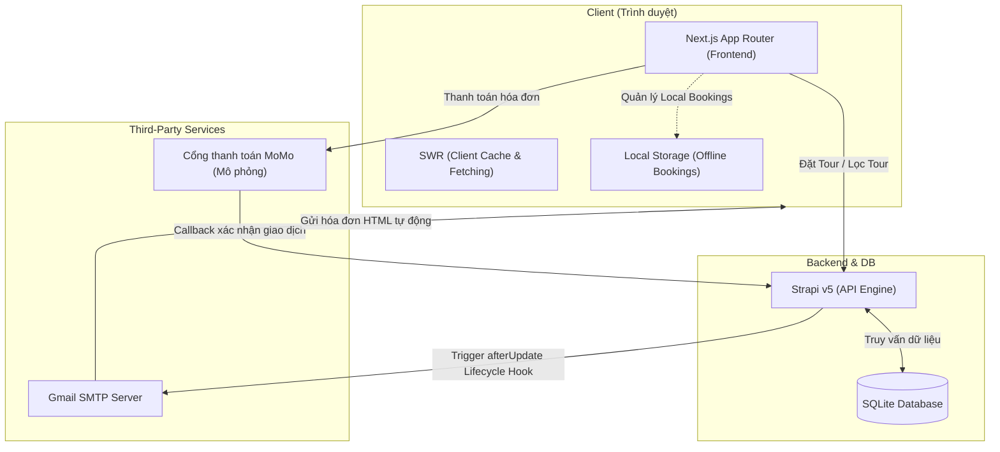

# VietTour - Hệ thống Đặt tour Du lịch Trực tuyến (Next.js & Strapi v5)


> **"Khám phá vẻ đẹp Việt Nam"** — Website du lịch & đặt tour trực tuyến hiện đại, đầy đủ tính năng từ tìm kiếm, đặt tour, thanh toán đến quản trị hệ thống.

Dự án **VietTour** là một hệ thống đặt tour du lịch trực tuyến hiện đại, thiết kế tối ưu và đầy đủ tính năng dành cho người dùng và quản trị viên. Hệ thống được phát triển bằng kiến trúc Headless CMS kết hợp giữa Frontend Next.js (App Router) và Backend Strapi v5.

Đây là sản phẩm thực tập tốt nghiệp được thiết kế và tối ưu hoàn chỉnh từ giao diện, trải nghiệm người dùng đến hệ thống cơ sở dữ liệu và tự động hóa email.

---

## 📸 Giao diện Dự án
- **Trang chủ**: Banner Parallax, thống kê số liệu ấn tượng, danh sách tour hot và đánh giá từ khách hàng.
- **Trang Điểm đến**: Bản đồ danh lam thắng cảnh Việt Nam, lọc tour theo từng tỉnh thành.
- **Trang Tìm kiếm & Bộ lọc**: Tìm kiếm thông minh theo từ khóa, lọc theo khoảng giá và sắp xếp không đồng bộ.
- **Trang Thanh toán & In hóa đơn**: Tích hợp MoMo QRCode, hỗ trợ in hóa đơn CSS `@media print` và xuất PDF vé điện tử.
- **Trang Cá nhân**: Theo dõi thông tin tài khoản, lịch sử đặt tour kèm trạng thái thanh toán và nút in lại hóa đơn.
- **Admin Dashboard**: Quản lý đơn đặt tour, duyệt phản hồi của khách hàng, chat trực tuyến hỗ trợ người dùng.

---

## ⚡ Các Tính năng Cốt lõi (Core Features)

### 1. 🔍 Tìm kiếm & Bộ lọc Tour thông minh
- Bộ lọc động không tải lại trang (Client-side filtering kết hợp SWR).
- Lọc tour theo khoảng giá (Dưới 5tr, 5 - 10tr, trên 10tr), điểm đến và sắp xếp theo giá cả hoặc độ mới.
- Hỗ trợ lưu trữ trạng thái bộ lọc trên URL thuận tiện cho SEO.

### 2. 💳 Tích hợp Thanh toán điện tử (MoMo QRCode)
- Luồng thanh toán tự động: Tạo hóa đơn -> Hiển thị QR Code thanh toán MoMo và đếm ngược -> Cập nhật trạng thái tức thì khi thanh toán thành công.

### 3. 📧 Tự động gửi Email Hóa đơn & Vé điện tử (Strapi Email Automation)
- Tích hợp hook `afterUpdate` trong Strapi Booking. 
- Ngay khi trạng thái thanh toán chuyển sang `paid`, hệ thống tự động soạn thảo và gửi một email hóa đơn HTML (thiết kế chuyên nghiệp, có barcode giả lập, mã đơn, chi tiết lịch trình) tới email khách hàng qua SMTP Gmail.

### 4. 🖨️ In hóa đơn tại chỗ (CSS Media Print)
- Nút **"In hóa đơn"** được tích hợp tại trang thành công và trong Lịch sử đơn hàng của trang cá nhân.
- Tự động định dạng trang in A4/A5 sạch sẽ, chuyên nghiệp bằng CSS `@media print` (ẩn Header, Footer và các nút tương tác).

### 5. 💬 Hệ thống Chat hỗ trợ trực tuyến
- Kênh chat thời gian thực giữa khách hàng và quản trị viên.
- Trang Admin Chat tích hợp trong trang quản lý giúp phản hồi khách hàng ngay lập tức.

### 6. 🛡️ Trang Quản trị Admin Dashboard
- Thống kê doanh thu biểu đồ trực quan.
- Phê duyệt và kiểm duyệt đánh giá (Reviews) của khách hàng trước khi hiển thị lên trang chi tiết tour.
- Quản lý danh sách thành viên và quyền hạn trực quan.

---

## 🛠️ Công nghệ Sử dụng (Tech Stack)

### Frontend (nextjs-frontend)
- **Framework**: Next.js 16.1.1 (App Router)
- **UI Library**: React 19.2.1
- **Styling**: Tailwind CSS 3.4.17
- **Data Fetching & Caching**: SWR 2.4.1 (Stale-While-Revalidate)
- **Kiểu dữ liệu**: TypeScript 5.7.2

### Backend (strapi-backend)
- **Framework**: Strapi v5 (Headless CMS)
- **Cơ sở dữ liệu**: SQLite (Mặc định trong môi trường phát triển)
- **Mail Server**: Nodemailer (qua SMTP Gmail)
- **Ngôn ngữ**: TypeScript

---

## 📐 Sơ đồ Kiến trúc Hệ thống



---

## 🚀 Hướng dẫn Cài đặt & Chạy Dự án

### Yêu cầu hệ thống:
- Node.js >= 18.x
- npm >= 9.x

### Bước 1: Khởi động Strapi Backend
1. Di chuyển vào thư mục backend:
   ```bash
   cd strapi-backend
   ```
2. Cài đặt các gói phụ thuộc:
   ```bash
   npm install
   ```
3. Thiết lập tệp `.env` dựa trên `.env.example` (Cấu hình SMTP Gmail, JWT Secret, v.v.).
4. Khởi chạy máy chủ ở chế độ phát triển:
   ```bash
   npm run develop
   ```
   *Backend sẽ chạy tại địa chỉ: `http://localhost:1337`*

### Bước 2: Khởi động Next.js Frontend
1. Di chuyển vào thư mục frontend:
   ```bash
   cd nextjs-frontend
   ```
2. Cài đặt các gói phụ thuộc:
   ```bash
   npm install
   ```
3. Khởi chạy máy chủ ở chế độ phát triển:
   ```bash
   npm run dev
   ```
   *Frontend sẽ chạy tại địa chỉ: `http://localhost:3000`*

---

